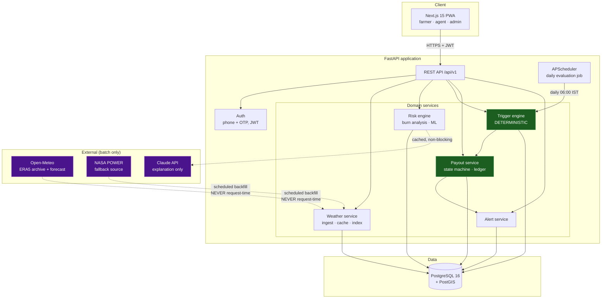

# 01 — Architecture & Technology Stack

## 1. Design principles

These four constraints resolve most downstream arguments. When a decision is contested, check it
against these before debating.

1. **Determinism at the money boundary.** Anything that moves money — index computation, threshold
   comparison, payout percentage — is pure, versioned, and replayable from stored inputs. No model
   inference, no LLM call, no network call sits on that path. If we cannot reproduce a payout six
   months later from the database alone, the design is wrong.
2. **Cache-first external data.** Weather providers are *ingestion sources*, not request-time
   dependencies. Every read serves from Postgres. This gives us auditability, demo safety, speed,
   and immunity from rate limits in one move.
3. **Deterministic floor, ML ceiling.** Every intelligent feature has a non-ML baseline built
   first. Burn analysis needs no training data and always works. ML improves the numbers; it never
   gates the product.
4. **One data path.** The browser talks to the API. The API owns the database. No direct DB access
   from the frontend, no second write path. With four developers and thirty hours, a second path is
   a guaranteed inconsistency bug at hour 27.

## 2. System architecture



Green = deterministic money path. Purple = external, always behind a cache or a fallback.
Note that no dotted (external) edge ever crosses into a green node.

## 3. Technology stack — with rationale

### 3.1 Frontend — **Next.js 15 (App Router) + TypeScript + Tailwind + shadcn/ui**

| Concern | Choice | Why |
|---------|--------|-----|
| Framework | Next.js 15, App Router | One artifact, one deploy target (Vercel), server components for fast first paint on rural 3G |
| Language | TypeScript, strict | Generated API types catch contract drift between Dev C and Dev A instantly |
| Styling | Tailwind CSS | Four developers, zero CSS merge conflicts, no naming debates |
| Components | shadcn/ui | Copy-in components — accessible, editable, no runtime dependency, no theme fight |
| Maps | **Leaflet + react-leaflet + OpenStreetMap tiles** | No API key, no billing account, no token to share across four laptops. Mapbox/Google would each cost 30 minutes of signup and a secret to leak. |
| Charts | Recharts | React-native API, good enough for the four charts we need |
| Data fetching | TanStack Query | Caching, retry, loading states for free — saves hours of `useEffect` |
| i18n | `next-intl` | Tamil/English toggle; message catalogues, not string spaghetti |
| Client type gen | `openapi-typescript` from FastAPI's `/openapi.json` | **This is the contract.** Regenerate on every API change. |

*Rejected:* Vite SPA + separate host (extra deploy surface); React Native (a mobile build in 30
hours is a demo-killer — a responsive PWA looks identical on a phone during a pitch).

### 3.2 Backend — **FastAPI (Python 3.11)**

The single most consequential choice, and it hinges on one fact: **the risk engine is Python.**
Historical weather replay, distribution fitting, and gradient boosting are pandas/numpy/scikit-learn
work. A Node backend would force a second Python service and an inter-service contract — an
integration seam we cannot pay for in 30 hours.

FastAPI specifically, over Django or Flask:
- **Auto-generated OpenAPI** — Dev C generates typed clients from hour 3 and works against a real
  schema, not a Slack message. This is the mechanism that makes 4-way parallelism actually work.
- **Pydantic v2** — request/response validation and the trigger-definition schema share one type
  system. The trigger JSON is validated by the same models that document it.
- **Async** where it helps (weather backfill fan-out), sync where it is simpler (CRUD).
- Django would bring an admin panel we would then fight; Flask would bring nothing and cost us the
  schema generation.

Supporting: SQLAlchemy 2.0 (typed ORM) · Alembic (migrations) · APScheduler (in-process daily job)
· `python-jose` + `passlib` (JWT) · `httpx` (async weather fetch) · `structlog` (JSON logs).

### 3.3 Database — **PostgreSQL 16 + PostGIS, hosted on Supabase**

| Requirement | How Postgres serves it |
|-------------|------------------------|
| Geospatial farm boundaries | PostGIS `GEOGRAPHY(POINT/POLYGON)`, `ST_Area`, `ST_DWithin` |
| Flexible trigger contracts | `JSONB` + GIN index — schema-free rules, queryable |
| Weather time series | ~35 yrs × 365 d × N cells; a composite PK and BRIN index handles it comfortably |
| Money correctness | `NUMERIC(14,2)` — **never** floats for currency |
| Audit | Append-only tables + transactional integrity |

**Hosted on Supabase** for one reason that dominates all others: *four developers share one
database from hour one.* No "works on my machine", no divergent local schemas, no seed drift. The
free tier includes PostGIS. `docker-compose` Postgres stays in the repo as an offline fallback and
for the unplugged demo.

*Rejected:* MongoDB (we need transactional money and relational joins); SQLite (no PostGIS, no
concurrent writers); a separate time-series DB (a second store to operate for data that Postgres
handles fine at this scale).

### 3.4 AI / ML risk engine — **pandas + NumPy + scikit-learn / LightGBM, in-process**

Runs inside the FastAPI process. No model server, no separate deployment.

- **Tier 1 (must work):** historical burn analysis — deterministic replay of 35 seasons. Zero
  training data required. Cannot fail to produce an answer.
- **Tier 2:** Monte Carlo simulation over fitted seasonal distributions — smooths a 35-sample
  estimate to 10,000 draws.
- **Tier 3:** LightGBM yield-loss model for trigger-threshold optimisation and basis-risk scoring.
- **Tier 4:** Claude (`claude-sonnet-4-5`) for plain-language, vernacular explanation only.

Full mathematics in [05 — AI/ML Design](./05-ai-ml-design.md). The tiering is deliberate: each
tier is independently shippable and the demo is complete at Tier 1.

### 3.5 Weather data — **Open-Meteo primary, NASA POWER fallback**

| Source | Role | Why |
|--------|------|-----|
| **Open-Meteo Archive API** (ERA5 reanalysis) | Primary historical, 1940→present, ~9 km | **No API key.** Four developers, four laptops, zero signup friction, no shared secret. Daily precipitation, tmax/tmin, soil moisture, ET₀ — exactly the index inputs. |
| **Open-Meteo Forecast API** | 16-day forecast for early warning | Same client, same shapes, no second integration |
| **NASA POWER** | Fallback historical, 1981→present | Independent agency source; different failure mode; also keyless |
| **IMD** (India Meteorological Department) | *Narrative only* — named as the production settlement source | Real parametric contracts must settle against a contractually-agreed independent index provider. We say this on stage; we do not integrate it in 30 hours. |

**Ingestion is strictly batch.** A backfill job populates `weather_observation` per grid cell. The
API never calls a weather provider inside a request. Grid cells are shared: farms are snapped to a
~0.1° cell, so a thousand farms in one block share one row per day instead of a thousand.

> ⚠️ **Verified constraint:** all three hosts return HTTP 403 at this session's egress proxy.
> Integration must be developed and tested on a team laptop, or the hosts allowlisted. See
> [00 §4](./00-repository-assessment.md#the-weather-api-finding-matters).

### 3.6 Authentication — **phone + OTP, FastAPI-issued JWT, mock OTP in dev**

Smallholder farmers have phone numbers, not email addresses. Email/password would be a fiction that
undermines the entire premise on stage.

- `POST /auth/otp/request` → `{phone}` → OTP stored hashed with 5-minute TTL
- `POST /auth/otp/verify` → `{phone, code}` → access JWT (30 min) + refresh JWT (7 d)
- **Dev/demo mode: fixed code `123456`, no SMS gateway.** Deliberate. Real SMS on a conference
  network is a demo failure waiting to happen, and it demonstrates nothing a judge cares about.
- Roles: `farmer` · `agent` · `admin`, enforced by a FastAPI dependency.
- Real SMS (MSG91/Twilio) is a NICE-TO-HAVE behind the same interface — one adapter swap.

*Rejected:* Supabase Auth. It is genuinely good, but its email-confirmation and OAuth redirect flows
cost setup time and add a live third-party call to the demo's first 30 seconds. We use Supabase for
Postgres and issue our own tokens. Documented as the post-hackathon upgrade in
[ADR-006](./09-assumptions-and-decisions.md).

### 3.7 Parametric trigger engine — **deterministic rule evaluator over frozen JSONB contracts**

The heart of the product, and the part that must be boring.

A policy carries a **frozen snapshot** of its trigger definition. Product templates may change;
issued contracts never do.

```jsonc
{
  "schema_version": "1.0",
  "peril": "rainfall_deficit",
  "index": "cumulative_rainfall_mm",
  "window": { "anchor": "sowing_date", "start_day": 45, "end_day": 75, "phase": "flowering" },
  "data_source": { "provider": "open-meteo", "dataset": "era5", "resolution_deg": 0.1 },
  "payout_tiers": [
    { "if_index_below": 120, "payout_pct": 25 },
    { "if_index_below":  90, "payout_pct": 50 },
    { "if_index_below":  60, "payout_pct": 100 }
  ],
  "settlement": { "evaluate_after_day": 75, "max_payout_pct": 100 }
}
```

Design decisions inside the engine:

- **Tiered, not binary.** A single on/off threshold creates a cliff — 121 mm pays nothing, 119 mm
  pays everything. Tiers are what real weather-index products use and they materially reduce basis
  risk. The cost is one loop.
- **Idempotent.** `UNIQUE (policy_id, evaluation_date)`. Re-running the job is always safe, which
  means we can re-run it on stage without fear.
- **Fully audited.** Every evaluation writes the exact index values, the source dataset, and the
  engine version into `policy_evaluation`. This row *is* the answer to "why was I paid?" — and it
  is what we open at the end of the demo.
- **Day-offsets, not calendar dates.** Windows anchor to `sowing_date` in whole days, UTC. Timezone
  arithmetic is the single most likely source of a silently wrong number on stage, so it is
  eliminated by design and covered by unit tests.

### 3.8 Payout simulation — **state machine + append-only ledger, mock UPI**

```
triggered → pending → approved → disbursed
                   ↘ rejected (manual, audited)
```

- `payout` rows are created *only* by the trigger engine, never by a user action.
- Every state change appends to `ledger_entry` — nothing is mutated in place.
- Disbursement is mocked: a synthetic UPI reference (`UPI/CS/<policy>/<seq>`) and an SMS-style card
  in the UI. India-appropriate and instantly legible to judges.
- **Amounts are `NUMERIC(14,2)`.** Payout = `sum_insured × payout_pct`, computed in Decimal.
- Headline metric surfaced in the UI: **time from trigger to disbursement**, against a 90-day
  industry benchmark. That number is the pitch.

*Not doing:* real payment rails. Razorpay test mode is NICE-TO-HAVE; real money is a NON-GOAL.

### 3.9 Deployment

| Component | Primary | Fallback |
|-----------|---------|----------|
| Frontend | **Vercel** — Git-push deploy, preview URL per PR | `next build && next start` on a laptop |
| Backend | **Render** (or Railway/Fly.io) — Docker, free tier | `uvicorn` on a laptop + Cloudflare Tunnel |
| Database | **Supabase** managed Postgres + PostGIS | `docker-compose` Postgres, seeded from committed fixtures |
| Scheduler | APScheduler in the API process | Manual "Run evaluation now" admin button |
| Secrets | Platform env vars; `.env.example` committed, `.env` never | — |

**Preview URLs per PR are worth calling out:** they let the team see each other's work without
merging, which is how four people stay unblocked.

**The offline path is a first-class requirement, not a contingency.** By H24 the whole system must
run from `docker-compose up` with a seeded database and no internet. Conference Wi-Fi has ended
more hackathon demos than bugs have.

## 4. Repository layout (proposed)

Directory boundaries are drawn to match the four-person split in
[07](./07-execution-plan.md) — each developer owns directories nobody else edits.

```
climate-shield/
├── docs/                        # this directory
├── backend/
│   ├── app/
│   │   ├── main.py
│   │   ├── core/                # config, security, deps        [Dev A]
│   │   ├── models/              # SQLAlchemy models             [Dev A]
│   │   ├── schemas/             # Pydantic — THE CONTRACT       [A+B, hour 2]
│   │   ├── api/v1/              # routers, one file per resource
│   │   ├── services/
│   │   │   ├── weather/         # ingest, cache, indices        [Dev B]
│   │   │   ├── risk/            # burn analysis, ML, pricing    [Dev B]
│   │   │   ├── trigger/         # deterministic evaluator       [Dev B]
│   │   │   ├── payout/          # state machine, ledger         [Dev B]
│   │   │   └── explain/         # Claude narration              [Dev D]
│   │   └── jobs/                # APScheduler tasks
│   ├── alembic/                 # migrations                    [Dev A]
│   ├── seeds/                   # crops, products, demo fixtures
│   └── tests/
├── frontend/
│   ├── app/
│   │   ├── (auth)/              # login, OTP                    [Dev C]
│   │   ├── (farmer)/            # farms, risk, policy, monitor  [Dev C]
│   │   └── (admin)/             # simulation console, portfolio [Dev D]
│   ├── components/
│   │   ├── ui/                  # shadcn primitives             [Dev D]
│   │   ├── map/                 # Leaflet                       [Dev C]
│   │   └── charts/              # Recharts                      [Dev D]
│   ├── lib/api/                 # GENERATED from OpenAPI — do not hand-edit
│   └── messages/                # en.json, ta.json              [Dev D]
├── docker-compose.yml
├── Makefile                     # make dev / seed / demo-reset / test
└── .github/workflows/ci.yml
```

## 5. Non-functional targets (hackathon-realistic)

| Property | Target | Note |
|----------|--------|------|
| Risk assessment latency | < 3 s | 35 years from cache; if slower, pre-warm the demo farm |
| Trigger evaluation | < 100 ms/policy | Pure computation over cached rows |
| Page load (3G) | < 3 s first paint | Server components; farmers are not on fibre |
| Demo path availability | **100 %** | The only SLO that matters on Saturday |
| Currency precision | Exact | `NUMERIC(14,2)` / `Decimal` throughout — no floats |
| Reproducibility | Total | Any payout re-derivable from stored inputs + `engine_version` |

## 6. Security & data governance (stated, scoped)

Doing a small amount well beats claiming a lot.

- **No Aadhaar, no bank account numbers, no PAN stored.** Not even masked. A hackathon prototype has
  no business holding them, and saying so out loud is a point in our favour, not against.
- Phone numbers are the only PII; OTPs stored as hashes with TTL.
- JWT `HS256`, short-lived access tokens; secrets from environment only.
- Ownership enforced server-side on every farm/policy route — a farmer can never read another
  farmer's policy by changing an ID.
- All monetary and evaluation tables are append-only.
- Rate limiting on `/auth/otp/request` (SHOULD-HAVE) to prevent trivial abuse.
- **Explicitly out of scope:** IRDAI regulatory compliance, real KYC, PCI. Named as such in
  [02 §4 NON-GOALS](./02-mvp-scope.md) so no one starts building them at 2am.
