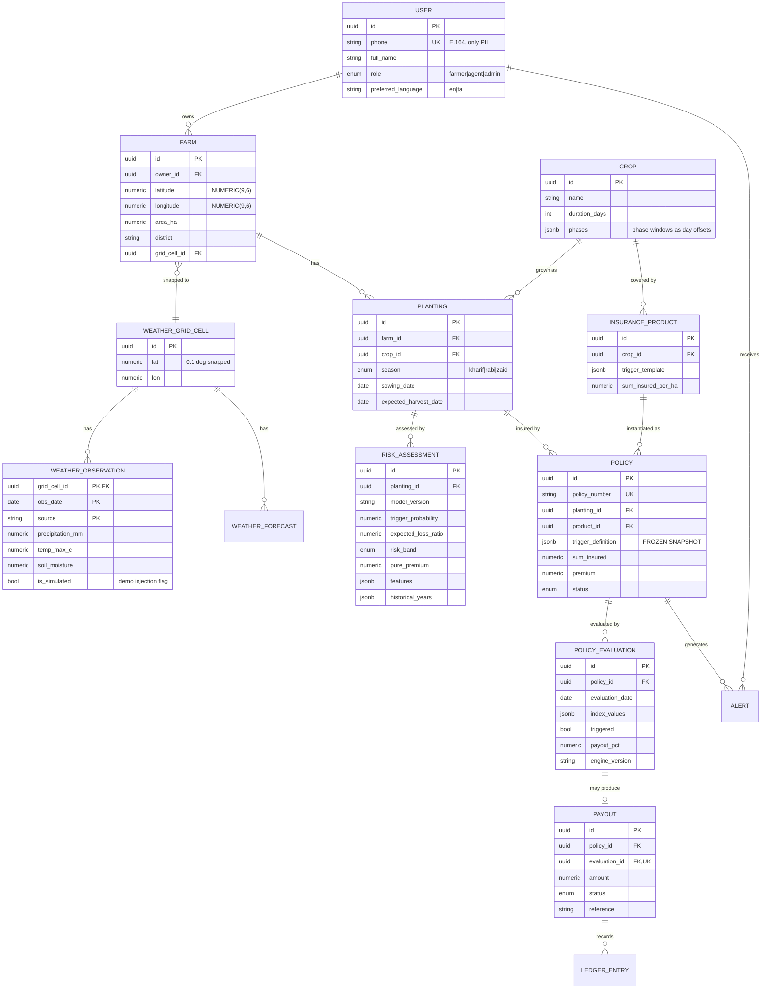

# 03 — Database Design

PostgreSQL 16. All identifiers are `UUID` (`gen_random_uuid()`). All timestamps are `TIMESTAMPTZ`
stored UTC. **All money is `NUMERIC(14,2)` — never `float`.**

> **PostGIS is optional and is not the starting point.** Farm location is stored as plain
> `latitude` / `longitude` `NUMERIC(9,6)` columns. Nothing in the MVP needs a spatial type — grid
> snapping is `round(lat/0.1)*0.1`, district filtering is an indexed string, and area is entered
> rather than derived. Adopt PostGIS only if a concrete need appears *and* it costs under 30
> minutes; the migration path is documented in
> [ADR-013](./09-assumptions-and-decisions.md#adr-013--postgis-is-optional-plain-latlon-is-the-default).

## 1. Entity–relationship diagram



## 2. Tables in detail

### 2.1 Identity

**`user`** — `id`, `phone` (E.164, unique), `full_name`, `role` (`farmer|agent|admin`),
`preferred_language` (`en|ta`), `created_at`, `last_login_at`.

**`farmer_profile`** — `user_id` (PK/FK), `village`, `district`, `state`, `land_holding_ha`,
`primary_income_source`, `bank_verified` (boolean only).

> **No Aadhaar. No PAN. No bank account number.** Not even masked. `bank_verified` is a boolean —
> we record *that* verification happened, never the identifier. This is a deliberate governance
> stance and worth stating on stage.

**`otp_challenge`** — `id`, `phone`, `code_hash`, `expires_at`, `consumed_at`, `attempts`.
Codes are hashed, TTL 5 minutes, max 5 attempts. Purged on consumption.

### 2.2 Farm & crop

**`farm`** — `id`, `owner_id` → `user`, `name`, **`latitude NUMERIC(9,6)`**,
**`longitude NUMERIC(9,6)`** (both **required**), `area_ha NUMERIC(8,2)`, `village`, `district`,
`state`, `soil_type`, `irrigation_type` (`rainfed|canal|borewell|drip`), `grid_cell_id` → cell,
`created_at`.

- `grid_cell_id` is assigned at insert by snapping the point to the nearest 0.1° cell. **Every
  downstream weather lookup keys on the cell, never on the farm.**
- `irrigation_type = rainfed` is a real risk feature — rainfed farms carry materially higher
  weather-index exposure.
- Index: `btree(owner_id)`, `btree(district)`, `btree(grid_cell_id)`. No spatial index needed —
  no query in the MVP does a spatial search.
- `NUMERIC(9,6)` gives ~11 cm of precision, far beyond what an 11 km weather grid can use. It is
  chosen for exactness rather than resolution: floats would make two identical pins compare unequal.
- **Optional PostGIS upgrade path:** add `location GEOGRAPHY(POINT,4326)` in a later migration,
  backfill with `ST_MakePoint(longitude, latitude)`, add `GIST(location)`. Nothing above needs to
  change; the lat/lon columns can stay as the source of truth.
- A polygon `boundary` column is deliberately **not** in the MVP. It is the one thing that would
  genuinely justify PostGIS, and it is a NICE-TO-HAVE.

**`crop`** — `id`, `name`, `variety`, `duration_days`, `water_requirement_mm`,
`phases JSONB`, `is_active`.

`phases` encodes the crop calendar as **day offsets from sowing** — never calendar dates:

```json
{
  "phases": [
    { "name": "germination", "start_day": 0,  "end_day": 20, "critical_water_mm": 60 },
    { "name": "vegetative",  "start_day": 21, "end_day": 44, "critical_water_mm": 140 },
    { "name": "flowering",   "start_day": 45, "end_day": 75, "critical_water_mm": 180,
      "stress_sensitivity": "high" },
    { "name": "grain_fill",  "start_day": 76, "end_day": 105, "critical_water_mm": 120 }
  ]
}
```

Seed set: maize, paddy, groundnut, cotton, millets (Tamil Nadu kharif-relevant).

**`planting`** — `id`, `farm_id`, `crop_id`, `season` (`kharif|rabi|zaid`), `year`, `sowing_date`,
`expected_harvest_date`, `sown_area_ha`, `expected_yield_kg_per_ha`, `status`
(`planned|growing|harvested|failed`).

A farm has many plantings across seasons; a *policy attaches to a planting*, not to a farm. This is
correct and matters: insurance covers a crop cycle, not land.

### 2.3 Weather

**`weather_grid_cell`** — `id`, `lat NUMERIC(6,3)`, `lon NUMERIC(6,3)`, `resolution_deg`
(default `0.1`), `region_label`. `UNIQUE (lat, lon, resolution_deg)`.

> **Why this table exists at all:** without it, a thousand farms in Pollachi block would each store
> their own copy of 35 years of daily weather — ~12.8 million rows for data that is identical. With
> it: 12,775 rows. This is the difference between a fast demo and a stalled one.

**`weather_observation`** — the fact table.

- **PK `(grid_cell_id, obs_date, source)`** — composite. Natural, and makes re-ingestion a trivial
  `ON CONFLICT DO UPDATE`.
- Columns: `precipitation_mm`, `temp_max_c`, `temp_min_c`, `temp_mean_c`, `humidity_pct`,
  `soil_moisture_m3m3`, `et0_mm`, `ingested_at`, `is_simulated BOOLEAN DEFAULT false`.
- `source` ∈ `open-meteo-era5` | `nasa-power` | `simulated`.
- **`is_simulated`** flags demo-injected rows. Non-negotiable: we must always be able to tell real
  data from stage data, and we must be able to `DELETE WHERE is_simulated` to reset a rehearsal.
- Index: `BRIN(obs_date)` — this table is naturally date-ordered and BRIN is ~1000× smaller than
  btree for the range scans we actually do.
- Expected volume: 4 districts × ~6 cells × 35 yrs × 365 d ≈ **307k rows**. Trivial for Postgres.

**`weather_forecast`** — `grid_cell_id`, `issued_date`, `target_date`, `source`, same measures.
PK `(grid_cell_id, issued_date, target_date, source)`. Keeping `issued_date` means we can honestly
show *what was known when* — a forecast is a statement made at a time.

### 2.4 Risk

**`risk_assessment`** — `id`, `planting_id`, `farm_id`, `model_version` (**required**),
`assessed_at`, `trigger_probability NUMERIC(5,4)`, `expected_loss_ratio NUMERIC(5,4)`,
`risk_band` (`low|medium|high|severe`), `pure_premium NUMERIC(14,2)`,
`recommended_premium NUMERIC(14,2)`, `confidence` (`low|medium|high`),
`features JSONB`, `historical_years JSONB`, `explanation_en TEXT`, `explanation_ta TEXT`,
`explanation_generated_at`.

- `model_version` on every row is what makes the model **auditable and comparable**. A score with
  no version is not evidence.
- `historical_years` stores the per-year replay — which of the 35 seasons would have paid, and how
  much. This drives the chart *and* is the evidence behind the number.
- Explanations are **stored, not generated on read.** The LLM is called once, asynchronously, and
  cached. A demo must never wait on an API call.
- Assessments are **append-only** — re-assessing writes a new row. Model drift stays visible.

### 2.5 Insurance

**`insurance_product`** — `id`, `code`, `name`, `crop_id`, `region_scope JSONB`,
`trigger_template JSONB`, `sum_insured_per_ha NUMERIC(14,2)`, `base_rate_pct`,
`subsidy_pct`, `min/max_area_ha`, `is_active`.

**`policy`** — the contract.

| Column | Note |
|--------|------|
| `policy_number` | Human-readable, unique: `CS-2026-KH-000142` |
| `farmer_id`, `farm_id`, `planting_id`, `product_id` | Denormalised FKs — worth it for query simplicity |
| `risk_assessment_id` | The assessment that priced it |
| `sum_insured`, `premium`, `subsidy_amount`, `farmer_paid` | `NUMERIC(14,2)` |
| **`trigger_definition JSONB`** | **FROZEN SNAPSHOT — see below** |
| `coverage_start`, `coverage_end` | Derived from sowing + crop duration |
| `status` | `draft \| active \| triggered \| settled \| expired \| cancelled` |
| `issued_at`, `engine_version_at_issue` | |

> **The single most important invariant in the schema.**
> `policy.trigger_definition` is a **copy** of the product template taken at issuance, not a
> reference to it. Products get tuned during a hackathon — sometimes at 4am. If policies pointed at
> a live template, editing a product would silently rewrite contracts that farmers already hold, and
> a payout computed today would not match the contract sold yesterday. Freezing the snapshot makes
> every issued policy independently interpretable forever. Enforce with a DB trigger that rejects
> `UPDATE` of this column on a non-draft policy.

**`policy_evaluation`** — the audit record, and the answer to "why was I paid?".

- `id`, `policy_id`, `evaluation_date`, `evaluated_at`, `index_values JSONB`, `triggered BOOLEAN`,
  `payout_pct NUMERIC(5,2)`, `tier_matched`, `data_source`, `data_completeness_pct`,
  `engine_version`, `is_final BOOLEAN`, `notes`.
- **`UNIQUE (policy_id, evaluation_date)`** — this one constraint makes the daily job idempotent.
  Re-running it is a no-op, which means we can re-run it on stage without fear.
- `index_values` holds the full computed picture:
  ```json
  { "cumulative_rainfall_mm": 82.4, "threshold_mm": 90, "window": {"start_day":45,"end_day":75},
    "days_elapsed": 75, "consecutive_dry_days": 19, "observations_used": 31, "missing_days": 0 }
  ```
- `data_completeness_pct` is honest engineering: if 4 of 31 days are missing, the evaluation should
  say so rather than quietly treating gaps as zero rainfall — a gap read as zero rain manufactures
  a drought that never happened.

### 2.6 Money

**`payout`** — `id`, `policy_id`, `evaluation_id` (**UNIQUE** — one payout per evaluation, the
duplicate-payment guard), `amount NUMERIC(14,2)`, `payout_pct`, `status`
(`pending|approved|disbursed|rejected|failed`), `method` (`upi_mock|bank_mock`), `reference`,
`triggered_at`, `approved_at`, `disbursed_at`, `failure_reason`.

- `disbursed_at − triggered_at` is the headline demo metric. Store both precisely.
- Payouts are created **only** by the trigger engine. No API route creates one.

**`ledger_entry`** — append-only: `id`, `payout_id`, `policy_id`, `entry_type`
(`premium_received|payout_reserved|payout_disbursed|reversal`), `amount`, `balance_after`,
`created_at`, `created_by`, `metadata JSONB`. No `UPDATE`, no `DELETE` — corrections are reversals.

### 2.7 Communication & audit

**`alert`** — `id`, `user_id`, `policy_id`, `type`
(`early_warning|trigger|payout|policy_expiring|weather_advisory`), `severity`, `title`, `body`,
`language`, `channel` (`in_app|sms|whatsapp`), `payload JSONB`, `created_at`, `sent_at`, `read_at`.

**`audit_log`** — `id`, `actor_id`, `actor_role`, `entity_type`, `entity_id`, `action`,
`before JSONB`, `after JSONB`, `ip`, `created_at`. Written on every policy/payout state change.

## 3. Invariants worth enforcing in the database

Constraints in the schema outlive constraints in someone's head at hour 27.

| # | Invariant | Mechanism |
|---|-----------|-----------|
| I1 | One evaluation per policy per day | `UNIQUE (policy_id, evaluation_date)` |
| I2 | One payout per evaluation | `UNIQUE (payout.evaluation_id)` |
| I3 | Frozen trigger definition | DB trigger blocking `UPDATE` when `status <> 'draft'` |
| I4 | Non-negative money | `CHECK (amount >= 0)`, `CHECK (premium >= 0)` |
| I5 | Payout ≤ sum insured | `CHECK` against policy, plus engine cap at 100 % |
| I6 | Coverage window sane | `CHECK (coverage_end > coverage_start)` |
| I7 | Probabilities in range | `CHECK (trigger_probability BETWEEN 0 AND 1)` |
| I8 | Ledger immutable | Revoke `UPDATE`/`DELETE`; corrections are reversal rows |
| I9 | Farm inside a grid cell | `NOT NULL` on `farm.grid_cell_id` |

## 4. Seed data required for the demo

| Dataset | Contents |
|---------|----------|
| Crops | Maize, paddy, groundnut, cotton, finger millet — with phase calendars |
| Districts | Coimbatore, Erode, Tiruppur, Dindigul (Tamil Nadu) |
| Grid cells | ~6 cells covering those districts |
| Weather | **1991–2026 daily observations for every seed cell** — the long pole; start at H2 |
| Products | 3 templates: rainfall-deficit maize, excess-rain paddy, heat-stress groundnut |
| Users | 1 admin, 1 agent, 3 farmers — including the demo farmer |
| Demo farm | Pollachi block, Coimbatore — maize, sown 15 June 2026 |

All seeds are deterministic and idempotent: `make seed` twice produces the same database.
`make demo-reset` clears `is_simulated` weather and re-arms the demo. **Both commands must exist
before the first rehearsal**, because a rehearsal you cannot repeat is not a rehearsal.

## 5. Deliberate simplifications

Each of these is a considered trade, not an oversight.

| Simplification | Trade-off accepted |
|----------------|--------------------|
| No farm boundary polygon; point + typed area is authoritative | Area is entered rather than derived. Sufficient for index insurance, and polygon drawing on mobile is a UX time sink. This is also what removes the only real reason to need PostGIS. |
| No reinsurance / capital-pool modelling | Portfolio solvency is a SHOULD (S8), not schema |
| Single currency (INR) | No FX table; correct for the target market |
| No soft deletes | Nothing is deleted in 30 hours |
| Grid cell at 0.1° (~11 km) | Matches ERA5's native resolution. Finer would be false precision, and pretending to 100 m accuracy from an 11 km product is exactly the basis-risk dishonesty we criticise elsewhere. |
| No partitioning on `weather_observation` | ~307k rows needs none. Revisit past ~50M. |
