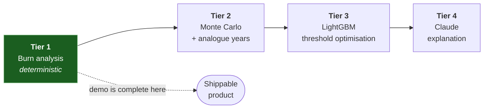

# 05 — AI / ML Design

## 1. Where AI provides meaningful value — and where it does not

Parametric insurance attracts a specific kind of fake AI: an LLM wrapper that "assesses risk" by
asking a chat model to guess a number. That is worse than useless here, because the number decides
whether a farmer eats. This section states plainly what AI is *for* in this system.

**The central technical problem of index insurance is basis risk** — the gap between what the index
says and what actually happened in the field. The index shows adequate rainfall; the crop failed
anyway. Or the index triggers and pays a farmer whose harvest was fine. Basis risk is why
index insurance has struggled to scale globally. Every genuinely valuable AI application in this
product reduces it or prices it.

| # | Application | Why it is real AI value | Tier |
|---|-------------|-------------------------|------|
| **A1** | **Risk quantification & pricing** — estimate P(trigger) and E[payout] from 35 years of reanalysis weather, per farm, per crop calendar | Today a smallholder cannot get a farm-specific price at all; products are priced at block level, which *is* basis risk. Computing this per grid cell in 3 seconds is the core value. | 1–2 |
| **A2** | **Trigger threshold optimisation** — learn the threshold that best separates loss years from normal years, instead of picking 40 % deficit by convention | Directly reduces basis risk. This is the highest-leverage ML in the system. | 3 |
| **A3** | **Early warning** — project end-of-season trigger probability from season-to-date data + forecast + analogue years | Converts insurance into *resilience*. A farmer warned at day 62 can irrigate, mulch, or re-sow. Compensation after the fact is the weaker product. | 2 |
| **A4** | **Basis-risk flagging** — disagreement between weather index and satellite vegetation anomaly | Catches the cases the index gets wrong, and is honest about them | 4 |
| **A5** | **Vernacular explanation (LLM)** — turn structured numbers into Tamil/English a farmer can act on | Genuine accessibility, not decoration. A policy nobody understands is not insurance. | 4 |

### And where AI is explicitly barred

> **The LLM never decides money.**
> Trigger evaluation is arithmetic: read cached observations, sum them over a day-offset window,
> compare to a frozen threshold, look up a tier. No inference, no sampling, no temperature. Given
> the same stored inputs, the answer is identical in 2026 and 2036.
>
> This is not conservatism — it is what makes the product an insurance contract rather than a
> suggestion. An insurer that cannot reproduce its own settlement decision has no product. When a
> judge asks "how do you stop the AI hallucinating a payout?", the answer is that the AI is not in
> that path, and the architecture diagram shows it.

## 2. Tiered engine — build order is the risk mitigation



Each tier ships independently and degrades gracefully to the one before. **Tier 1 requires zero
training data and cannot fail to produce an answer.** If every ML component collapses at hour 20,
the product is still complete and the demo still runs. This ordering is the whole risk strategy.

---

## 3. Tier 1 — Historical burn analysis *(MUST HAVE)*

The method actual reinsurers use to price weather-index products. Replay history and count.

### Inputs
- 35 years of daily reanalysis weather for the farm's grid cell (ERA5, 1991–2025)
- The crop's phase calendar as day offsets from sowing
- The product's trigger definition (window, index, tiers)

### Algorithm

```
for each historical year y in 1991..2025:
    anchor  = same month-day as this season's sowing_date, in year y
    window  = [anchor + start_day, anchor + end_day]
    I_y     = index(window)                    # e.g. Σ precipitation_mm
    p_y     = payout_fraction(I_y, tiers)      # 0, 0.25, 0.50, or 1.00

trigger_probability = |{y : p_y > 0}| / N
E[p]                = Σ w_y · p_y             # w_y = climate-trend weights
σ[p]                = weighted std deviation

pure_premium  = E[p] × sum_insured
risk_margin   = k · σ[p] · sum_insured        # k ≈ 0.5
expense_load  = 0.10 × pure_premium
gross_premium = pure_premium + risk_margin + expense_load
farmer_pays   = gross_premium × (1 − subsidy_pct)
```

### Climate-trend weighting — the detail that fits the theme

Plain burn analysis assumes the climate is stationary. It is not; that is the premise of the entire
hackathon. Weighting recent years more heavily is a one-line change with a real justification:

```
w_y ∝ exp(−ln 2 · (current_year − y) / H)      # H = half-life ≈ 12 years
```

A 2024 season then carries roughly four times the weight of a 1994 season. This is defensible,
cheap, and directly on-theme: **we price the climate we are in, not the one we had.** Both weighted
and unweighted numbers are stored so the difference is visible and honest.

### Risk bands

| Band | Trigger probability | Meaning |
|------|--------------------|---------|
| `low` | < 10 % | Historically reliable rainfall in this window |
| `medium` | 10–25 % | Roughly one failure per 4–10 seasons |
| `high` | 25–40 % | Roughly one failure per 3 seasons |
| `severe` | > 40 % | Marginal for this crop; recommend a shorter-duration variety |

`severe` returning crop advice rather than only a price is deliberate — the most useful answer to
"this land is very risky for maize" is "consider millets", not a larger premium.

### Why this is genuinely good, not a fallback in disguise
Explainable to a farmer in one sentence ("8 of the last 35 years would have paid"), auditable,
instantaneous over cached data, needs no labels, and is what the reinsurance industry actually does.
Tier 1 is a real answer, not a placeholder.

---

## 4. Tier 2 — Monte Carlo & analogue-year projection *(SHOULD HAVE)*

### 4a. Monte Carlo pricing
35 observations is a thin sample for a tail probability — a 3 % event may appear 0 or 3 times by
luck. So: fit a distribution to the windowed index (Gamma for rainfall totals, fitted by MLE), draw
10,000 seasons, apply the tier table, take the mean.

Reported alongside Tier 1, never replacing it. Where they disagree materially, that disagreement is
surfaced as *lower confidence* rather than hidden behind a single number.

### 4b. Analogue-year early warning — the resilience feature

The question a farmer actually has at day 62 is *"am I going to be paid, and should I act now?"*

```
1. Build this season's cumulative-rainfall curve up to today (day d)
2. Build the same curve for each of the 35 historical years, up to day d
3. Rank historical years by Euclidean distance to this season's curve → keep k = 12 analogues
4. For each analogue: complete the remaining season with that year's actual rainfall,
   overriding the next 16 days with the live forecast
5. Apply the trigger to each of the k completed seasons
6. P(trigger) = weighted fraction that trigger, weights ∝ 1/distance
```

Cheap, transparent, uses no black box, and produces a number with a real interpretation: *"of the 12
seasons that looked most like this one at day 62, 8 ended in a payout."* That sentence is more
persuasive to both a farmer and a judge than a neural network would be.

Alert fires when P(trigger) crosses 0.5 with ≥ 10 days of the window remaining — enough time for
protective irrigation to matter.

---

## 5. Tier 3 — Learned threshold optimisation *(SHOULD HAVE)*

The strongest "real ML" claim available, and it attacks basis risk directly.

**The problem it solves.** A trigger at 120 mm is a convention, not a finding. If the true rainfall
level below which maize yields collapse in this agro-climatic zone is 138 mm, then every farmer
between 120 and 138 mm loses their crop and receives nothing — the exact failure that makes farmers
distrust index insurance.

**Approach**
- **Labels:** district-season crop yield from open Indian agricultural statistics (ICRISAT
  district-level dataset; data.gov.in crop production series). Yield is detrended, then converted
  to a loss ratio against the district's rolling expected yield.
- **Features:** phase-wise cumulative rainfall, consecutive dry days, heat-degree days above 34 °C,
  excess-rain days, soil-moisture minimum, season-total rainfall as a fraction of normal, ET₀ deficit,
  irrigation type, plus district and crop.
- **Model:** LightGBM regressor → predicted loss ratio. Grouped CV by district (never random
  split — random splits leak neighbouring districts and inflate scores).
- **Use:** sweep candidate thresholds; choose the one maximising correlation between modelled payout
  and observed loss ratio, subject to `pure_premium` staying within the product's rate band.
- **Metrics reported honestly:** MAE on held-out districts, and *basis-risk reduction* — the drop in
  mean absolute difference between payout and actual loss versus the naive threshold. That second
  number is the one that matters and the one to put on a slide.

**Guardrails.** District-level yield labels against a per-farm index is a genuine granularity
mismatch, and we say so rather than overclaim. If held-out performance is poor, Tier 3 is dropped
entirely and Tier 1 thresholds stand. **Tier 3 is never on the demo critical path.**

---

## 6. Tier 4 — Claude as the explanation layer *(SHOULD HAVE)*

**Model:** `claude-sonnet-4-5`. **Role:** narration and translation. **Never** computation.

The accessibility case is real: a smallholder farmer in Pollachi facing an English PDF that says
*"cumulative precipitation deficit below the 120 mm threshold during the 45–75 day phenological
window"* has not been informed of anything. A policy that cannot be understood is not insurance.

### Contract with the model

Numbers go **in**, prose comes **out**. The model is given a compact structured payload and is
forbidden from producing new figures:

```jsonc
{ "crop": "maize", "district": "Coimbatore", "trigger_probability": 0.23,
  "years_analysed": 35, "years_triggered": 8,
  "trigger_years": [1994, 2002, 2003, 2012, 2016, 2019, 2023, 2024],
  "threshold_mm": 120, "window_phase": "flowering",
  "premium_inr": 2169, "sum_insured_inr": 72000, "max_payout_inr": 72000,
  "risk_band": "medium", "language": "ta" }
```

System-prompt constraints:
1. Use **only** the numbers supplied. Never compute, estimate, round differently, or introduce a
   figure not present in the payload.
2. Target a farmer with limited formal literacy. Short sentences. Concrete comparisons.
3. Do not promise outcomes; describe how the contract behaves.
4. In Tamil, use everyday agricultural vocabulary, not administrative register.
5. Cover exactly four things: what was measured, what was found, what triggers a payment, what it
   costs.

### Engineering around it
- **Generated once, stored** in `risk_assessment.explanation_en` / `explanation_ta`. Read paths
  never call the API.
- **Generated asynchronously** after the assessment returns — the risk number is never blocked on a
  network call.
- **Static per-band fallback strings** in both languages if the API is unavailable. The UI must
  never show an error where an explanation belongs.
- **Pre-generated for all demo entities before the presentation.** Nothing in the 4:30 script waits
  on an external model.

### Guarded second use — trigger definition to plain language
Converting a `trigger_definition` JSON into a readable contract clause is also LLM work, but it is
generated at **product definition time**, reviewed by a human, and stored on the product. It is not
generated per policy at runtime, because a contract's wording must be stable.

---

## 7. Model governance

| Practice | Implementation |
|----------|----------------|
| Versioning | `model_version` on every `risk_assessment`; `engine_version` on every `policy_evaluation` |
| Reproducibility | Fixed random seeds; inputs stored as `features JSONB` alongside every output |
| Auditability | `historical_years` retains the full per-year replay behind each score |
| Data lineage | `source` + `is_simulated` on every weather row; `data_completeness_pct` on every evaluation |
| Honest uncertainty | `confidence` downgraded when data completeness < 95 %, when Tier 1 and Tier 2 disagree materially, or when years analysed < 25 |
| No silent gaps | Missing weather days are counted and reported — **never** imputed as zero rainfall, which would manufacture a drought that did not occur |
| Separation of duties | LLM output is stored in explanation columns only; no code path reads them back into a decision |

## 8. What we will say honestly on stage

Overclaiming is the fastest way to lose a technically literate judging panel. These are the
limitations to state before anyone asks:

- **Reanalysis is not a rain gauge.** ERA5 at ~11 km resolution can miss a convective cell over a
  single hectare. Real deployment requires a contractually agreed settlement source (IMD gridded
  data or a station network) and ground-truth calibration.
- **Basis risk is reduced, not eliminated.** It is inherent to index insurance. We measure it and
  flag it rather than pretending otherwise.
- **District-level yield labels are coarse** for a farm-level index; Tier 3 is an improvement
  direction, not a validated actuarial model.
- **Premiums are technically derived, not regulatory-approved.** An actual product needs IRDAI
  filing, reinsurance capacity, and an actuarial sign-off.
- **35 years under a shifting climate** is a limited sample for tail risk. The trend weighting is a
  partial correction, not a solution.

Stating these makes the parts that *are* solid — the deterministic engine, the audit trail, the
sub-second pricing — considerably more credible.
